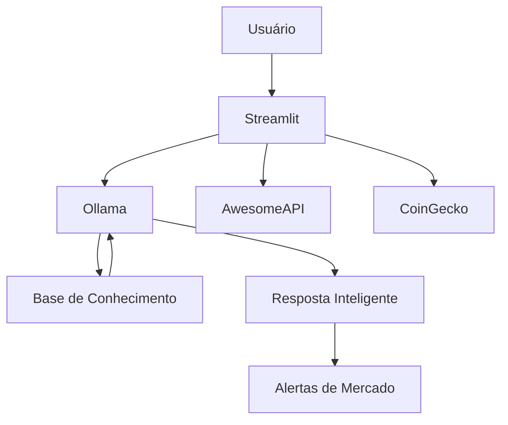

# 🎨 Assets da Câmbia

> Repositório central de recursos visuais, materiais de apresentação e artefatos de apoio do projeto **Câmbia – Guia de Câmbio e Cripto**.

Esta pasta concentra todos os elementos utilizados na documentação, demonstrações, apresentações e materiais de avaliação da solução.

---

## 📖 Sumário

* Sobre a Câmbia
* Objetivo desta Pasta
* Inventário de Assets
* Galeria da Aplicação
* Arquitetura da Solução
* Vídeo Pitch
* Estrutura do Repositório
* Guia de Execução
* Status do Projeto
* Autor
* Licença

---

## 💱 Sobre a Câmbia

A **Câmbia** é uma assistente financeira baseada em Inteligência Artificial Generativa, desenvolvida para auxiliar usuários no acompanhamento de moedas estrangeiras e criptoativos.

A aplicação combina um modelo de linguagem executado localmente com fontes externas de cotação para fornecer respostas contextualizadas sobre:

* Dólar (USD)
* Euro (EUR)
* Bitcoin (BTC)
* Carteira financeira do usuário
* Histórico de movimentações
* Conceitos de câmbio e criptomoedas

### Funcionalidades

| Recurso                   | Descrição                         |
| ------------------------- | --------------------------------- |
| 📈 Cotações em tempo real | Consulta de USD, EUR e BTC        |
| 💼 Carteira consolidada   | Patrimônio atualizado             |
| 🚨 Alertas inteligentes   | Oscilações relevantes de mercado  |
| 📚 Educação financeira    | Explicações sobre câmbio e cripto |
| 📝 Histórico              | Registro das operações realizadas |

### Escopo do Projeto

A Câmbia possui caráter educacional e demonstrativo.

Não realiza:

* Recomendações de investimento
* Operações financeiras reais
* Compra ou venda de ativos
* Consultoria financeira profissional

---

## 🎯 Objetivo desta Pasta

Os arquivos presentes em `assets/` são utilizados para:

* Documentação técnica
* README principal
* Wiki do projeto
* Demonstrações visuais
* Apresentações para avaliação
* Vídeo Pitch
* Materiais de portfólio

---

## 📂 Inventário de Assets

| Arquivo                                  | Finalidade              | Status |
| ---------------------------------------- | ----------------------- | ------ |
| `Câmbia - Guia de Câmbio.pdf`            | Documento de contexto   | ✅      |
| `cambia-menu-lateral-aberto.png`         | Interface completa      | ✅      |
| `cambia-menu-lateral-fechado.png`        | Interface simplificada  | ✅      |
| `leu-a-pergunta-e-pensa-na-resposta.png` | Processamento do agente | ✅      |
| `P1.png`                                 | Consulta patrimonial    | ✅      |
| `P2.png`                                 | Análise financeira      | ✅      |
| `P3.png`                                 | Consulta cambial        | ✅      |
| `P4.png`                                 | Conteúdo educativo      | ✅      |
| `P5.png`                                 | Continuação da análise  | ✅      |
| `video-pitch-cambia.mp4`                 | Apresentação oficial    | ✅      |
| `arquitetura-cambia.png`                 | Diagrama arquitetural   | ✅      |
| `cambia-demo.gif`                        | Demonstração animada    | ✅      |

---

## 📸 Galeria da Aplicação

### Interface Principal

#### Menu lateral aberto


Visualização completa contendo:

* Perfil da cliente
* Carteira financeira
* Cotações atualizadas
* Indicadores de mercado
* Área conversacional

#### Menu lateral fechado


Experiência focada exclusivamente na interação com o agente.

### Processamento de Solicitações


Representação do momento em que o modelo interpreta o contexto e gera uma resposta.

### Exemplos de Respostas

#### Patrimônio Consolidado


Consulta detalhada dos ativos financeiros.

#### Análise Patrimonial


Avaliação baseada no histórico da cliente.

#### Consulta Cambial


Resposta contextualizada sobre o mercado de moedas.

#### Educação Financeira


Explicações sobre Bitcoin e volatilidade.

#### Continuação da Análise


Complementação das recomendações educacionais.

---

## 🏗️ Arquitetura da Solução

### Stack Tecnológica

| Camada       | Tecnologia  |
| ------------ | ----------- |
| Front-end    | Streamlit   |
| LLM Runtime  | Ollama      |
| Modelo       | llama3.2:1b |
| API Cambial  | AwesomeAPI  |
| API Cripto   | CoinGecko   |
| Persistência | JSON e CSV  |
| Linguagem    | Python      |

### Fluxo Operacional



### Descrição do Fluxo

1. O usuário envia uma solicitação.
2. O Streamlit organiza o contexto.
3. O Ollama processa a consulta localmente.
4. A base de conhecimento fornece informações complementares.
5. APIs externas atualizam as cotações.
6. A resposta é apresentada ao usuário.
7. Alertas são exibidos quando aplicável.

---

## 🎬 Vídeo Pitch

### Conteúdo

* Problema
* Solução
* Arquitetura
* Demonstração
* Diferenciais

### Duração

3 minutos

### Publicação

YouTube (não listado)

---

## ⚙️ Estrutura do Repositório

```text
Cambia_Guia-de-Cambio-e-Cripto/
├── assets/
├── data/
├── docs/
├── src/
├── app.py
├── requirements.txt
├── README.md
├── LICENSE
└── .gitignore
```

---

## 🚀 Guia de Execução

### Instalação

```bash
pip install -r requirements.txt
```

### Configuração do Ollama

```bash
ollama pull llama3.2:1b
ollama serve
```

### Execução

```bash
streamlit run app.py
```

### Execução com Makefile

```bash
make install
make run
```

---

## 📊 Status do Projeto

| Entregável      | Situação      |
| --------------- | ------------- |
| Desenvolvimento | ✅ Concluído  |
| Funcionalidades | ✅ Concluído  |
| Documentação    | ✅ Concluído  |
| Assets Visuais  | ✅ Concluído  |
| Testes          | ✅ Concluído  |
| Vídeo Pitch     | ✅ Concluído  |

---

## 👨‍💻 Autor

**Pedro PM Dias**

Projeto desenvolvido para demonstrar conhecimentos em:

* Inteligência Artificial Generativa
* Engenharia de Prompt
* Python
* Streamlit
* Ollama
* Integração de APIs

---

## 📜 Licença

Distribuído sob a licença Apache 2.0.

Consulte o arquivo `LICENSE` para mais informações.
