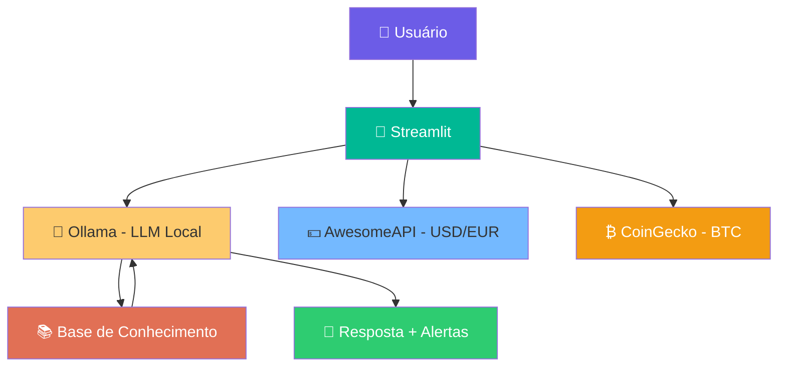

<!-- assets/README.md -->

# 🎨 Assets da Câmbia

> *Porque uma boa apresentação visual vale mais que mil palavras — ainda mais quando o assunto é dinheiro.*

Esta pasta reúne todos os recursos visuais do projeto Câmbia: screenshots, diagramas e o vídeo de pitch.

---

## 📂 Conteúdo

|                 Arquivo                  |                  Descrição                   |   Status    |
|------------------------------------------|----------------------------------------------|-------------|
| `Câmbia - Guia de Câmbio.pdf`            | Primeiro documento de contexto da Câmbia     | ✅ Incluído |
| `cambia-menu-lateral-aberto.png`         | Screenshot: Câmbia com menu lateral aberto   | ✅ Incluído |
| `cambia-menu-lateral-fechado.png`        | Screenshot: Câmbia com menu lateral fechado  | ✅ Incluído |
| `leu-a-pergunta-e-pensa-na-resposta.png` | Screenshot: Câmbia processando resposta      | ✅ Incluído |
| `P1.png`                                 | Screenshot: Detalhe de resposta do chat      | ✅ Incluído |
| `P2.png`                                 | Screenshot: Detalhe de resposta do chat      | ✅ Incluído |
| `P3.png`                                 | Screenshot: Detalhe de resposta do chat      | ✅ Incluído |
| `P4.png`                                 | Screenshot: Detalhe de resposta do chat      | ✅ Incluído |
| `P5.png`                                 | Screenshot: Detalhe de resposta do chat      | ✅ Incluído |
| `video-pitch-cambia.mp4`                 | Vídeo do Pitch da Câmbia (3 minutos)         | ⬜ Pendente |
| `arquitetura-cambia.png`                 | Diagrama da arquitetura do agente            | ⬜ Pendente |
| `cambia-demo.gif`                        | GIF animado do fluxo de uso da Câmbia        | ⬜ Pendente |

---

## 📸 Screenshots da Aplicação

> *Câmbia em pleno funcionamento — chat interativo, alertas de variação, badges de status do mercado e cotações em tempo real na sidebar. Veja a seguir alguns momentos-chave da interação.*

### Tela Inicial (Menu Lateral Aberto)

*Legenda: Interface completa com sidebar (perfil + cotações), badges de mercado (status) e chat interativo com quick replies.*

### Tela Principal (Menu Lateral Fechado)

*Legenda: Detalhe do chat demonstrando as 'Quick Replies' e o campo de input, com o menu lateral recolhido.*

### Câmbia Processando uma Pergunta

*Legenda: Momento em que o agente de IA está processando a solicitação do usuário, antes de apresentar a resposta.*

### Detalhes das Respostas da Câmbia

Vários momentos-chave de interação e respostas detalhadas da Câmbia.

*Legenda: Detalhe da resposta da Câmbia ao solicitar o valor total da carteira, com discriminação dos ativos.*

*Legenda: Exemplo de análise personalizada do patrimônio, considerando transações passadas e orientações estratégicas.*

*Legenda: Resposta contextualizada sobre a cotação do dólar hoje, com análise de impacto no patrimônio e sugestão de oportunidade.*

*Legenda: A Câmbia explica a volatilidade do Bitcoin, os riscos e a importância da pesquisa antes de investir.*

*Legenda: Complemento da análise de patrimônio, destacando a diversificação e a inteligência da Câmbia sobre as estratégias do usuário.*

---

## 🎬 Vídeo do Pitch

> *Demonstração de 3 minutos comigo apresentando problema, solução, demo ao vivo e diferenciais.*

📺 **[https://www.youtube.com/]**

*O vídeo estará como **não listado** no YouTube — só acessa quem tiver o link.*

---

## 🏗️ Diagrama de Arquitetura

### Explicação do fluxo

1. **Usuário** faz uma pergunta pelo chat do Streamlit
2. **Streamlit** monta o prompt com o contexto da cliente e envia para o **Ollama**
3. **Ollama** processa com o modelo `llama3.2:1b` localmente
4. **Base de Conhecimento** (`data/`) fornece perfil, carteira e histórico
5. **AwesomeAPI** e **CoinGecko** enriquecem o contexto com cotações reais
6. A **resposta** é exibida no chat junto com **alertas proativos** se houver oscilação >2%

---

## 🎯 Checklist de Assets

|    Recurso     |    Formato    |                     Onde é usado                      |
|----------------|---------------|-------------------------------------------------------|
| 📸 Screenshots |      PNG      | `src/README.md`, `docs/05-pitch.md`, `README.md` raiz |
| 🎬 Vídeo Pitch | MP4 / YouTube |                  `docs/05-pitch.md`                   |
|  🏗️ Diagrama   | Mermaid / PNG |            `docs/01-documentacao-agente.md`           |
| 🎨 Logo Câmbia |    PNG/SVG    |       Opcional — usar como favicon no Streamlit       |
