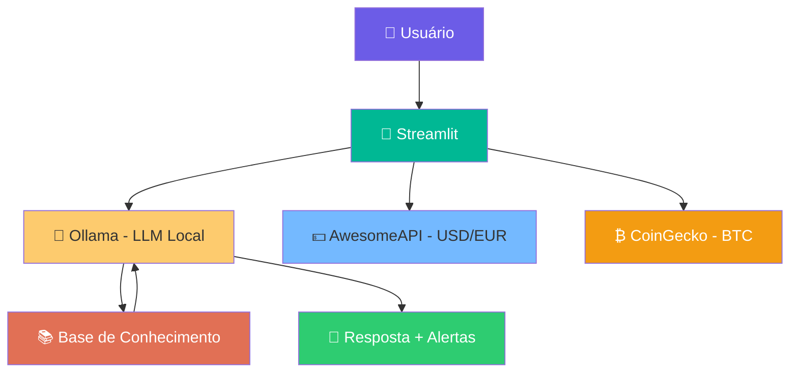

<!-- assets/README.md -->

# 🎨 Assets da Câmbia

> *Porque uma boa apresentação visual vale mais que mil palavras — ainda mais quando o assunto é dinheiro.*

Esta pasta reúne todos os recursos visuais do projeto Câmbia: screenshots, diagramas e o vídeo de pitch.

---

## 📂 Conteúdo

|         Arquivo          |              Descrição               |   Status    |
|--------------------------|--------------------------------------|-------------|
| `cambia-screenshot.png`  | Tela principal da Câmbia em execução | ⬜ Pendente |
| `cambia-pitch.mp4`       | Vídeo do Pitch (3 minutos)           | ⬜ Pendente |
| `arquitetura-cambia.png` | Diagrama da arquitetura do agente    | ✅ Incluído |
| `cambia-demo.gif`        | GIF animado do fluxo de uso          | 🟡 Opcional |

---

## 📸 Screenshot da Aplicação

> *Câmbia em pleno funcionamento — chat interativo, alertas de variação, badges de status do mercado e cotações em tempo real na sidebar.*

*Legenda: Interface completa com sidebar (perfil + cotações), badges de mercado, alerta proativo e chat com quick replies.*

---

## 🎬 Vídeo do Pitch

> *Demonstração de 3 minutos comigo apresentando problema, solução, demo ao vivo e diferenciais.*

📺 [Assistir ao Pitch da Câmbia no YouTube](https://youtube.com/...)

*O vídeo está como **não listado** — só acessa quem tem o link.*

---

## 🏗️ Diagrama de Arquitetura

### Explicação do fluxo

1. **Usuário** faz uma pergunta pelo chat do Streamlit
2. **Streamlit** monta o prompt com o contexto da cliente e envia para o **Ollama**
3. **Ollama** processa com o modelo `llama3.2:1b` localmente
4. **Base de Conhecimento** (`data/`) fornece perfil, carteira e histórico
5. **AwesomeAPI** e **CoinGecko** enriquecem o contexto com cotações reais
6. A **resposta** é exibida no chat junto com **alertas proativos** se houver oscilação >2%

---

## 🎯 Checklist de Assets

|    Recurso     |    Formato    |                     Onde é usado                      |
|----------------|---------------|-------------------------------------------------------|
| 📸 Screenshot  |      PNG      | `src/README.md`, `docs/05-pitch.md`, `README.md` raiz |
| 🎬 Vídeo Pitch | MP4 / YouTube |                  `docs/05-pitch.md`                   |
|  🏗️ Diagrama   | Mermaid / PNG |            `docs/01-documentacao-agente.md`           |
| 🎨 Logo Câmbia |    PNG/SVG    |       Opcional — usar como favicon no Streamlit       |
