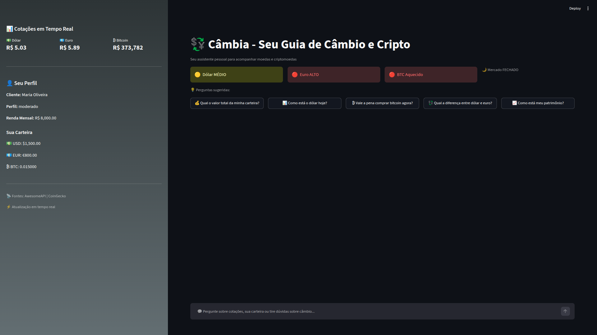
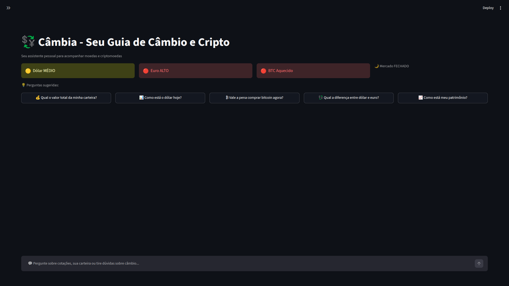
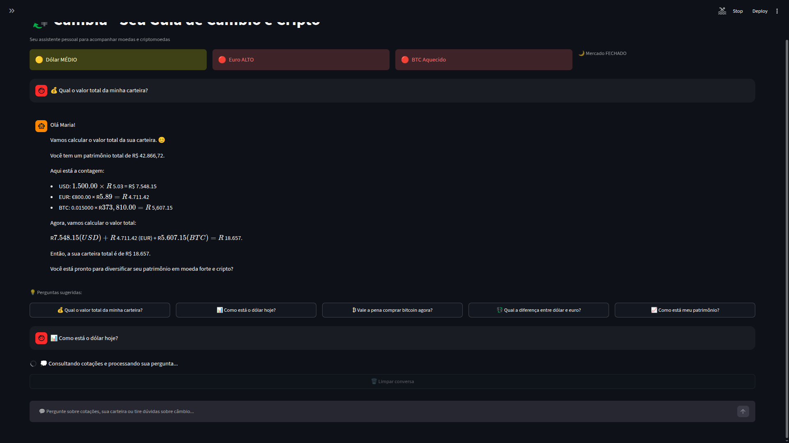
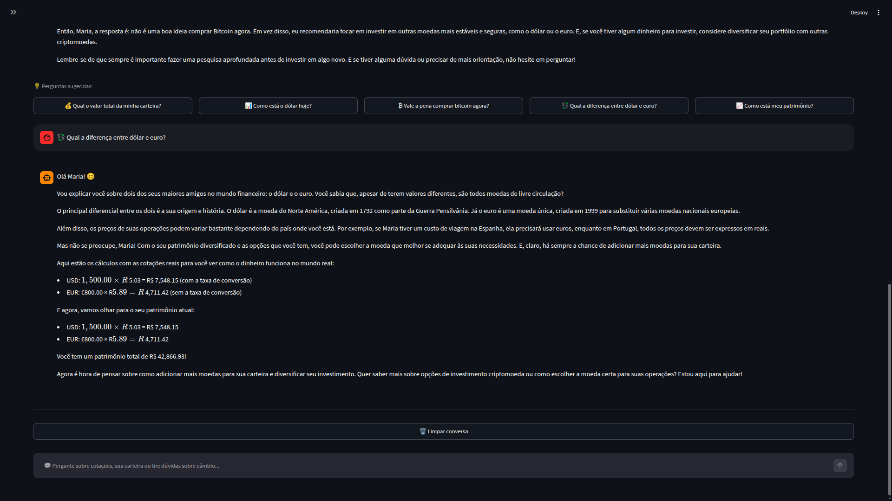
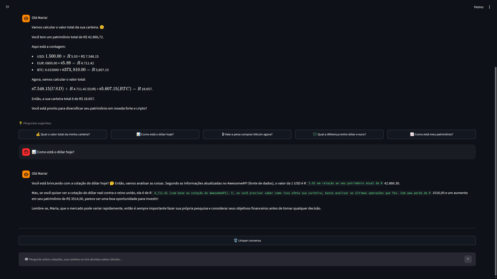
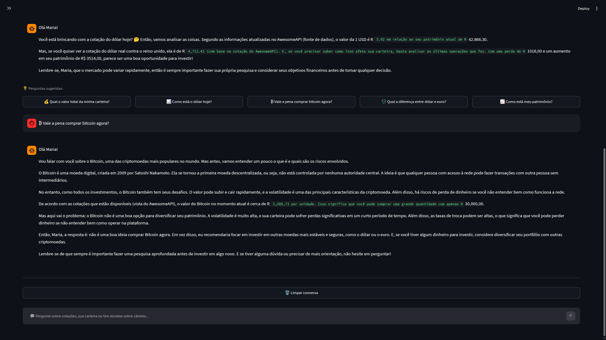
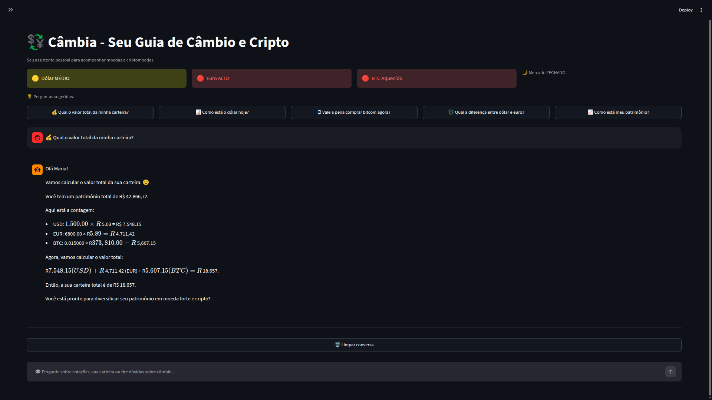
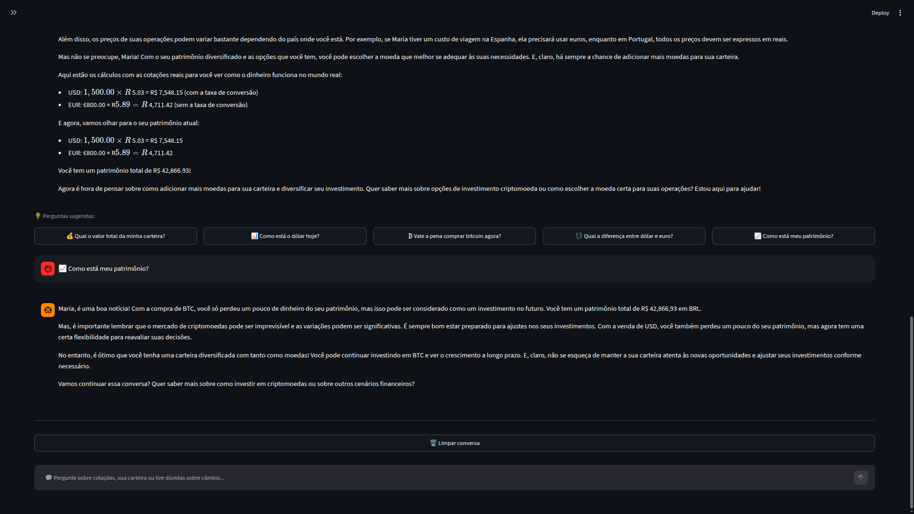
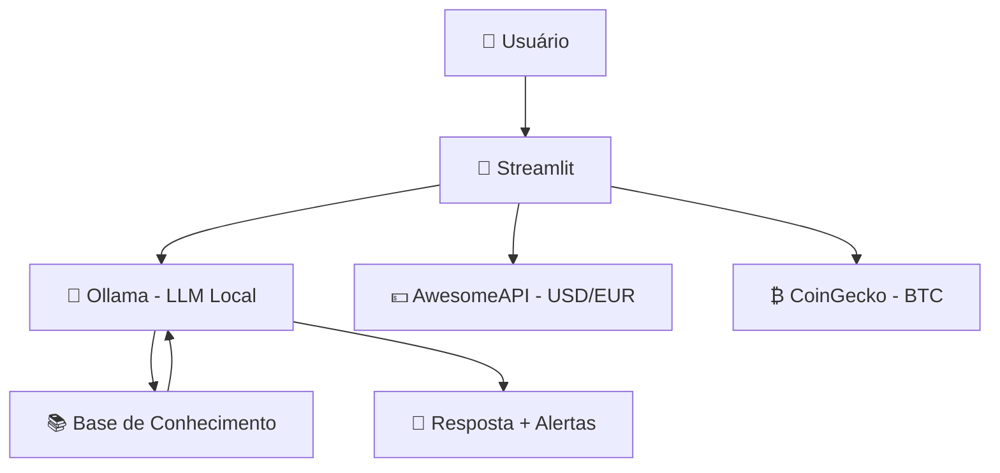

# 🎨 Assets da Câmbia

> Prints, diagramas, vídeo e materiais visuais do projeto — todos gerados e prontos para entrega.

---

## 📂 Inventário de Arquivos

|                 Arquivo                  |                    O que mostra                    |          Uso          |
|------------------------------------------|----------------------------------------------------|-----------------------|
|     `cambia-menu-lateral-aberto.png`     |           Interface completa com sidebar           | Documentação e README |
|    `cambia-menu-lateral-fechado.png`     |                 Chat em foco total                 | Documentação e README |
| `leu-a-pergunta-e-pensa-na-resposta.png` |          Agente processando uma pergunta           |     Documentação      |
|                 `P1.png`                 | Consulta: "Qual o valor total da minha carteira?"  |   Galeria do README   |
|                 `P2.png`                 |        Análise: "Como está meu patrimônio?"        |   Galeria do README   |
|                 `P3.png`                 |        Consulta: "Como está o dólar hoje?"         |   Galeria do README   |
|                 `P4.png`                 |      Resposta: "Vale a pena comprar bitcoin?"      |   Galeria do README   |
|                 `P5.png`                 |         Continuação da análise financeira          |   Galeria do README   |
|        `video-pitch-cambia.mp4`          |         Pitch de apresentação (3 minutos)          | Avaliação do desafio  |
|      `Câmbia - Guia de Câmbio.pdf`       |              Resumo do projeto em PDF              |       Portfólio       |

---

## 📸 Galeria da Aplicação

### Interface Principal

**Tela completa com sidebar aberta:**

*Visualização com perfil da cliente, cotações em tempo real, badges de mercado e chat interativo.*

---

**Chat em foco (sidebar fechada):**

*Experiência focada exclusivamente na conversa com o agente.*

---

**Agente processando uma pergunta:**

*Momento em que o modelo interpreta o contexto e gera a resposta.*

---

### Exemplos de Interação

|                Pergunta                 | Resposta da Câmbia |
|-----------------------------------------|--------------------|
| "Qual o valor total da minha carteira?" |     |
|       "Como está meu patrimônio?"       |     |
|        "Como está o dólar hoje?"        |     |
|     "Vale a pena comprar bitcoin?"      |     |
|         Continuação da análise          |     |

---

## 🎬 Vídeo Pitch

[🎥 Assistir ao Pitch da Câmbia no YouTube](https://www.youtube.com/watch?v=le9QLG0Wfvo)

> *Vídeo publicado como **não listado** — acessível apenas pelo link.*

**Conteúdo do vídeo:**

- 🎯 Problema: ansiedade na hora de comprar moeda estrangeira
- 💡 Solução: a Câmbia como guia de câmbio e cripto
- 📱 Demonstração ao vivo do app funcionando
- ✨ Diferenciais: alertas sonoros, badges, quick replies, 100% local

---

## 🏗️ Diagrama de Arquitetura

**Stack:** `Streamlit` · `Ollama` · `llama3.2:1b` · `AwesomeAPI` · `CoinGecko` · `Python`

---

## ✅ Status de Entrega

> **Projeto concluído e finalizado.** Todos os recursos visuais foram gerados, a documentação está completa e o vídeo pitch está publicado. O projeto está pronto para avaliação.

|        Entregável         | Status |
|---------------------------|:------:|
|  Documentação do agente   |   ✅   |
|   Base de conhecimento    |   ✅   |
|  Prompts e system prompt  |   ✅   |
|    Aplicação funcional    |   ✅   |
| Métricas e casos de teste |   ✅   |
|        Vídeo Pitch        |   ✅   |
|      Assets visuais       |   ✅   |
|   README e documentação   |   ✅   |

---

## 👨‍💻 Autor

### **Pedro PM Dias**

Projeto desenvolvido como parte do desafio de agentes de IA no setor financeiro.

---

## 📜 Licença

Apache 2.0 — consulte o arquivo [LICENSE](../LICENSE) para mais informações.
